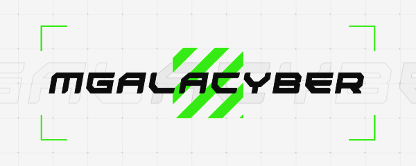

      

<h1 align="center">
<!--       <a href="https://galacyber.xyz"> -->
            
      </a>
      Hi, I'm
      <a href="https://galacyber.is-a.dev">MGalaCyber</a>
</h1>

<h3 align="center">
  Discord bot Developer | Random Person
</h3>

***

  
  

<!-- 

 -->

***

  

- 👨‍💻 All of my projects are available at [GalaCyber Projects](https://github.com/MGalaCyber?tab=repositories)
- 👨‍💻 All of my gits are available at [GalaCyber Gits](https://gist.github.com/MGalaCyber)

> <h3 align="left"> Connect with me:</h3>

<!--  -->
<!--  --> 

 

> <h3 align="left"> Languages and Tools: </h3>

<!--  -->
<!--  -->

<!--  -->
<!--  -->
<!--  -->
<!--  -->
<!--  -->
<!--  -->

<!--  -->
<!--  -->

<!--  -->
<!--  -->
<!--  -->
<!--  -->

> <h3 align="left">Support:</h3>
  
  <!--  -->
 
 

***
  

Click Here for My Github Stats

 

  
  
  <a href="https://github.com/MGalaCyber">
    
    

  </a>
  
  
  

***
      
  

***
## [Discord Server](https://discord.gg/VzGNhtmmfB) | [Website](https://galacyber.vercel.app)

***
## SUPPORT ME AND MGALACYBER DEVELOPMENT

> You can always Support me by inviting one of my **own Discord Bots**

Click Here for Support My Botz

 
  
  

  

***
## CREDIT
> If You use my **Source Code**, please add *credit* in your description or inside your code

Click Here for View Credit Template

      -------------------------------------------
      Author      : MGalaCyber
      Discord     : GalaXd#9165
      Github      : https://github.com/MGalaCyber
      Server      : https://discord.gg/VzGNhtmmfB
      -------------------------------------------

<!--  -->
<!--  -->
<!--  -->
<!--  -->
